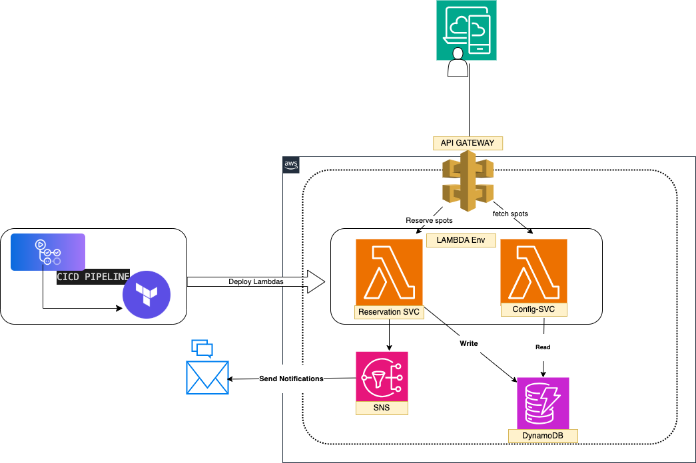
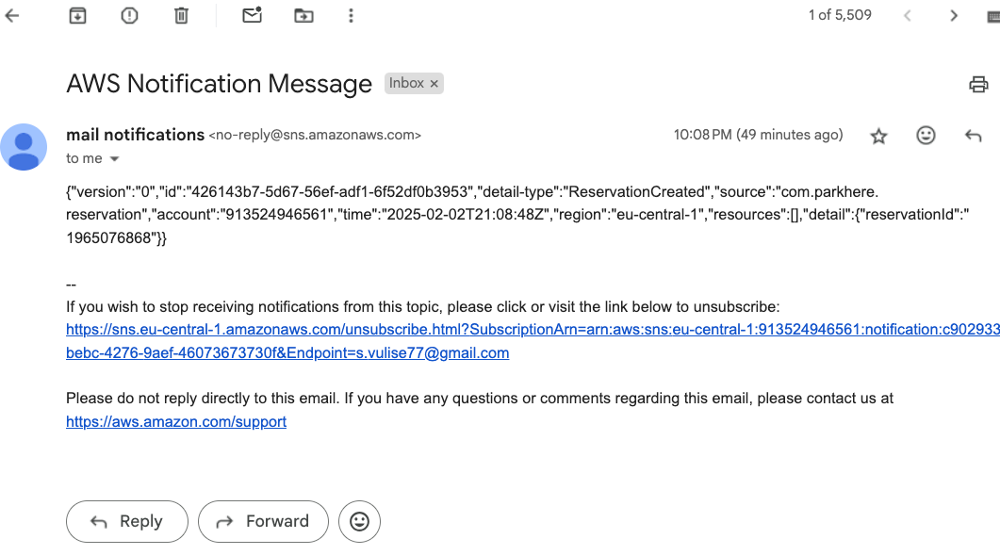
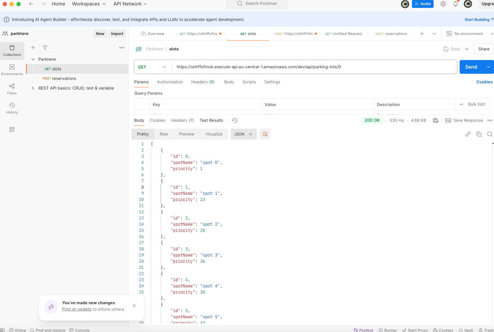
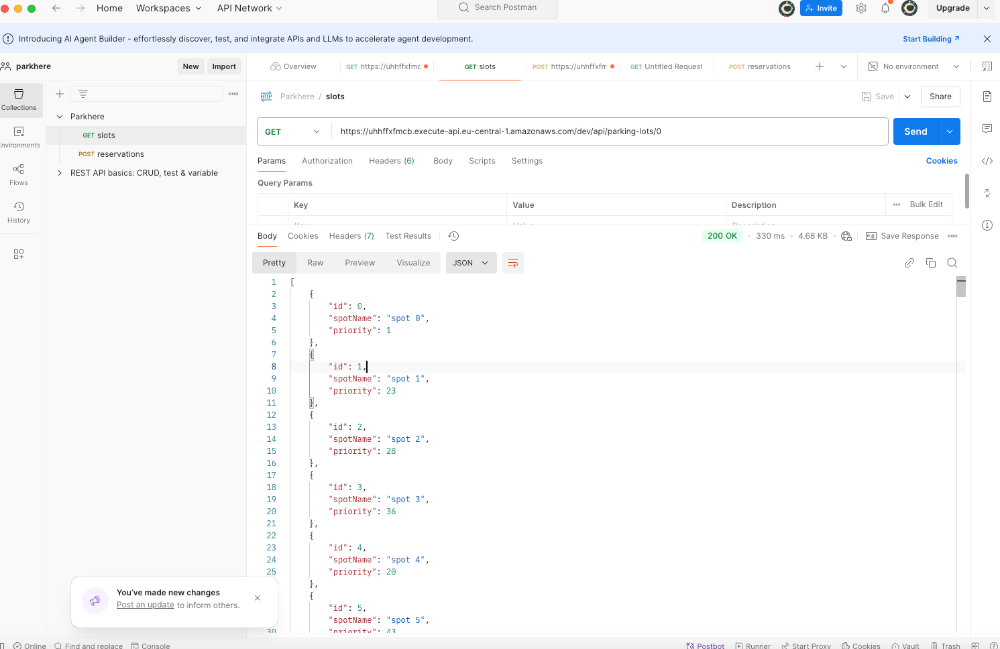

# Reservation serverless API

This is a serverless API that provides a reservation service. It is built using the Serverless Framework deploy on
AWS Lambda.

System design diagram:

How to run the application:
1. clone the repository
2. run mvn clean install
3. deploy the application using AWS CLI or Serverless Framework OR Upload the Zip file to AWS Lambda, select Java 17
   as the runtime and set the handler to com.parkhere.configuration.StreamLambdaHandler::handleRequest.
4. Create DynamoDB tables with the name "ParkingLots" with Partition key as Id and create Indxes "ParkingLotIdIndex"
   with Partition key as parkingLotId and Sort key as spotId.
   ParkingLots Table columns:  id (Number), parkingLotId, priority, spotId, spotName
5.  Create 2nd tables with the name "Reservations" with Partition key as reservationId and softkey as parkingLotId
    and create Indxes "UserIdIndex" with Partition key as userId (String)
    ParkingLots Table columns:  reservationId (Number), parkingLotId (Number), endTimestamp, sporId, startTimestamp ,
    parkingLotId,
    priority,
    spotId, spotName
6. Test the application on AWS Lambda console.
7. Once the registration is done, User will get the reservationId in the response as well he receives the email with the 
   reservation details.
  
7. Configure the API Gateway to expose the Lambda function as a REST API. Please refer the below schema for the API 
   Gateway configuration.

8. CICD Pipeline: you can use Github actions to deploy the applications (two micro services config-service and 
reservation)
to AWS Lambda, this process is automated
and the
deployment is triggered when a new commit is pushed to the master branch. The repository contains a
Github actions file for the deployment by using terraform scripts. you can find them in the .github/workflows folder.
and terraform scripts in the terraform folder.
Postman collection for the API testing is available in the postman folder.
screenshots of postman for reference.

Please refer to the [Serverless Framework documentation](https://serverless.com/framework/docs/) for more information on how to deploy and manage serverless applications.